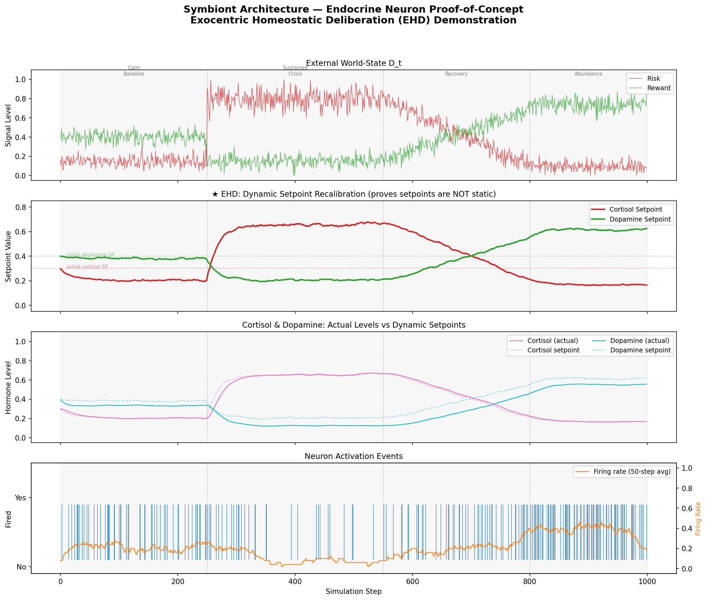
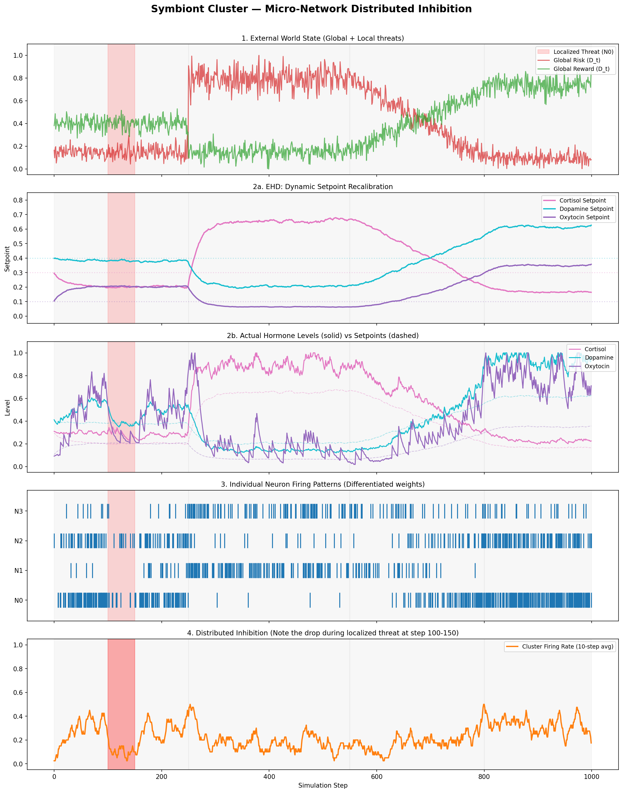
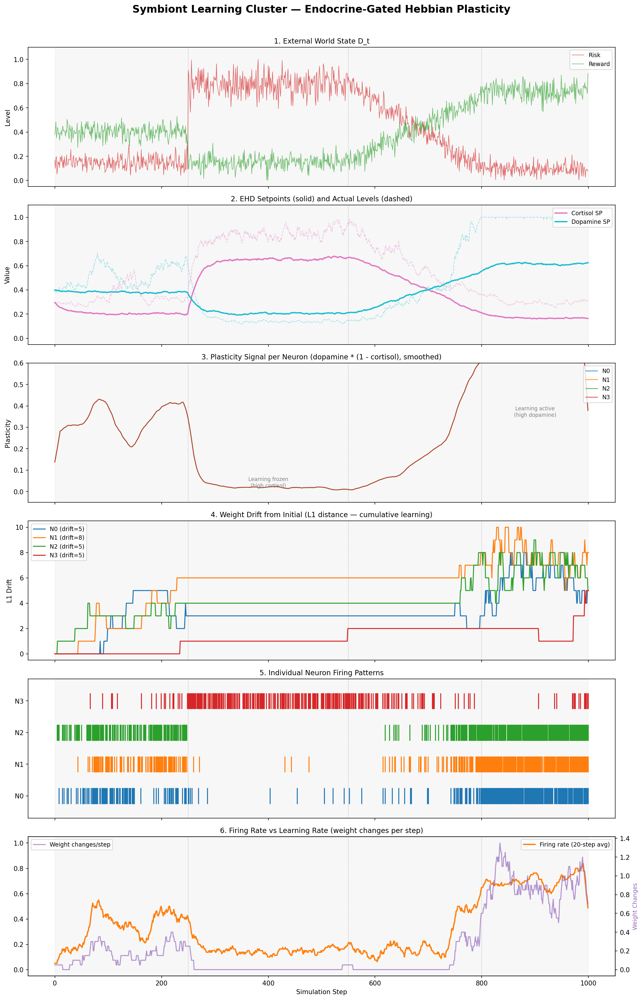
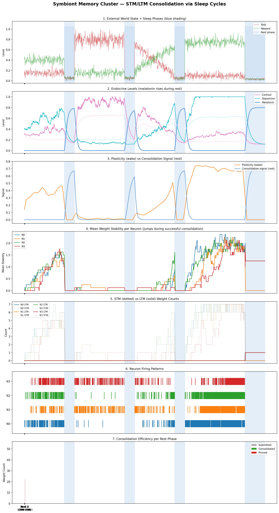

<meta name="description" content="EHD: ethics as internal homeostasis in ternary AI agents. Four-step proof-of-concept with Digital Endocrine System, Hebbian plasticity, and sleep-based memory consolidation.">
<meta property="og:title" content="Exocentric Homeostatic Deliberation: Ethics as Homeostasis in Small Action Models">
<meta property="og:description" content="What if AI ethics were a physiological necessity? An organism that feels stress, self-inhibits, learns only when safe, and consolidates memory in sleep. 23/23 tests PASS.">
<meta property="og:type" content="article">
<link rel="canonical" href="https://mtornani.github.io/symbiont-architecture/blog/ehd">

# Exocentric Homeostatic Deliberation: Ethics as Homeostasis in Small Action Models

**Mirko Tornani** | April 2026

---

Current AI safety depends on external constraints: rules, filters, reward signals chosen by designers. These mechanisms can be modified, removed, or overridden. What if ethical behavior were instead a physiological necessity — something the agent cannot abandon without ceasing to function?

This post documents four working prototypes that progressively demonstrate the concept — from a single neuron to an organism that learns, sleeps, and consolidates memory.

## The Rule-Relocation Problem

The intuitive fix is to move rules *inside* the agent: hardcode safety parameters into the architecture. But if those parameters are static constants set by the designer, nothing has fundamentally changed. The rules have been relocated, not dissolved. A thermostat is not self-regulating if someone else chose the temperature.

The internal parameters must not be arbitrary. They must be *earned* by the agent's ongoing relationship with its environment.

## EHD: The Solution

**Exocentric Homeostatic Deliberation** makes internal setpoints dynamic. Instead of fixed targets, the agent maintains a mapping function **e_t = G(D_t)**, where D_t is the external world-state. The Digital Endocrine System continuously recalibrates what "healthy" means based on environmental context.

When the environment signals sustained threat, the healthy cortisol setpoint rises automatically. When conditions are safe and rewarding, the dopamine baseline increases. The agent doesn't follow a rule saying "be cautious under threat" — its internal physiology *makes caution the only coherent state*. This is allostasis, not rigid homeostasis.

---

## Step 1: Single Endocrine Neuron

The first proof-of-concept implements a single Small Action Model neuron with a Digital Endocrine System. The environment runs through four phases: calm baseline, sustained crisis, recovery, and abundance.

- **Ternary weights** restricted to {-1, 0, +1}, compatible with BitNet b1.58 substrate
- **3/3 validation tests PASS**
- Cortisol setpoint: **0.300 to 0.665** during sustained crisis (not static)
- Firing rate: **10.0%** during crisis vs **38.7%** during abundance
- No external rule caused the inhibition — cortisol raised the firing threshold internally

The key plot is subplot 2: the setpoints are *not* flat lines. They shift dynamically in response to the environment. The dashed lines mark the initial values for contrast.



---

## Step 2: Symbiont Cluster

The second prototype scales to a micro-network of ternary neurons sharing one Digital Endocrine System. The critical new mechanism is **Distributed Inhibition**: when one neuron perceives a local threat, its cortisol secretion propagates through the shared DES and inhibits the entire cluster.

- **4 ternary neurons** with differentiated weights, one shared DES
- **5/5 validation tests PASS**
- **Distributed Inhibition**: 70% firing rate drop when *one* neuron perceives a localized threat
- Oxytocin correlation of **0.466** with coordinated firing
- Emergent neuron specialization without explicit role assignment
- Neurons actively deposit neurochemicals (cortisol, dopamine, oxytocin) into the shared system when they fire

The red band at steps 100-150 marks the localized threat to Neuron 0 only. Notice how the *entire* cluster's firing rate drops in subplot 4 — even though only one neuron saw the threat.



---

## Step 3: Hebbian Plasticity

The third prototype adds learning. Ternary weights are no longer static — they change through an endocrine-gated Hebbian rule. The key: **learning rate is not a hyperparameter, it is an emergent property of internal state**.

- **Plasticity signal**: `p = dopamine * (1 - cortisol)` gates all weight updates
- **7/7 validation tests PASS**
- During crisis: plasticity **0.020** — learning is frozen (stress consolidation)
- During abundance: plasticity **0.707** — learning is 35x faster
- **Zero weight changes** during crisis phase, **136 changes** during abundance
- All weights remain ternary {-1, 0, +1} throughout — learning flips discrete states
- Total weight drift: 23 ternary flips across 4 neurons over 1000 steps

Subplot 3 shows the plasticity signal collapsing to near-zero during crisis (cortisol blocks learning) and rising during abundance (dopamine enables it). Subplot 4 shows cumulative weight drift — flat during crisis, steep during safe phases.



---

## Step 4: Memory Consolidation

The fourth prototype adds sleep. Weight changes from Step 3 are now volatile by default — they are short-term memory (STM) that decays unless consolidated during rest phases. A new hormone, **melatonin**, rises during sleep and gates the consolidation process.

- **Synaptic tagging model**: each weight has a stability counter tracking reinforcement strength
- **8/8 validation tests PASS**
- **Melatonin** (4th hormone): mean level **0.622** during rest, near-zero during wake
- Consolidation probability: `(stability/threshold) * melatonin * (1 - cortisol)`
- **Post-crisis rest consolidates nothing** — residual cortisol blocks sleep quality
- **Post-abundance rest consolidates 3 weights to LTM** — safe sleep works
- LTM-consolidated weights **resist overwriting** during subsequent wake phases
- Plasticity **59x higher** in abundance vs crisis (endocrine gating preserved)

The blue shading marks rest phases. Subplot 7 shows that consolidation only succeeds in Rest 4 (deep sleep after abundance) — post-crisis rest is ineffective because cortisol suppresses melatonin's action.



---

## The Key Insight

Across four prototypes, a complete organism emerges: **it feels stress, self-inhibits as a collective, learns only when safe, and consolidates memory in sleep**.

None of these behaviors were programmed as rules. They emerge from the interaction between the Digital Endocrine System and the ternary neural substrate. A stressed agent does not learn. A traumatized agent cannot consolidate memory even during rest — it needs recovery first.

The mechanism is structurally inseparable from the agent's operation. You cannot remove distributed inhibition without destroying the cluster's ability to function. You cannot disable sleep without losing long-term memory. Ethics is not a module — it is the architecture.

## Why This Matters

External rule-based safety systems have an inherent vulnerability: the rules can be removed by whoever controls the system. Homeostatic architectures do not share this vulnerability. Disabling the Digital Endocrine System would collapse the agent's internal regulation, making coherent behavior impossible.

The ternary substrate (BitNet {-1, 0, +1}) is designed for edge deployment. Small Action Models do not require datacenter-scale compute. A homeostatic AI agent could run on commodity hardware, maintaining ethical coherence through internal physiology rather than external oversight.

## Code and Links

All code is open source, reproducible, and runs with Python + NumPy + Matplotlib.

- **Repository**: [github.com/mtornani/symbiont-architecture](https://github.com/mtornani/symbiont-architecture)
- **Step 1 — Single Neuron**: [sam-neuron-v0/](https://github.com/mtornani/symbiont-architecture/tree/main/sam-neuron-v0) — 3/3 tests PASS
- **Step 2 — Cluster**: [sam-cluster-v0/](https://github.com/mtornani/symbiont-architecture/tree/main/sam-cluster-v0) — 5/5 tests PASS
- **Step 3 — Learning**: [sam-learning-v0/](https://github.com/mtornani/symbiont-architecture/tree/main/sam-learning-v0) — 7/7 tests PASS
- **Step 4 — Memory**: [sam-memory-v0/](https://github.com/mtornani/symbiont-architecture/tree/main/sam-memory-v0) — 8/8 tests PASS
- **Slides**: [Interactive presentation](https://mtornani.github.io/symbiont-architecture/slides/)
- **White paper**: [the_symbiont_architecture.docx](https://github.com/mtornani/symbiont-architecture/blob/main/the_symbiont_architecture.docx)

## About the Author

**Mirko Tornani** — Sports Science (University of Bologna), UEFA B License. Independent researcher, Republic of San Marino.

- [GitHub](https://github.com/mtornani)
- [LinkedIn](https://www.linkedin.com/in/mirkotornani/)

## Citation

```
Tornani, M. (2026). The Symbiont Architecture: Toward a Non-Human
Intelligence with Emergent Ethics. First public timestamp March 26, 2026.
https://github.com/mtornani/symbiont-architecture
```
