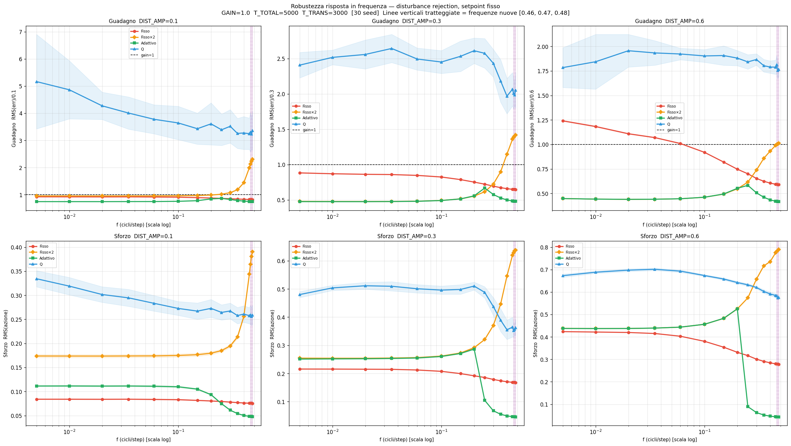
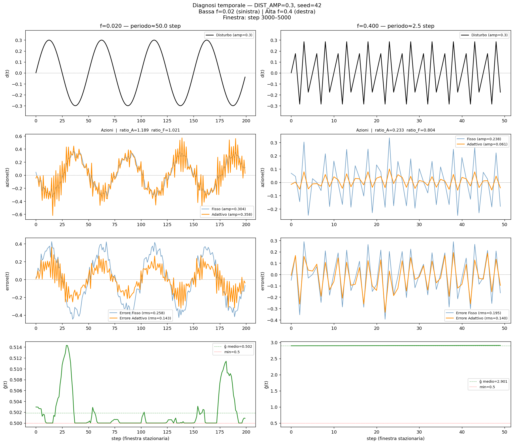
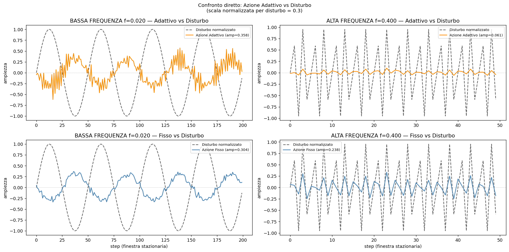

<meta name="description" content="Frequency response benchmark: ĝ online gain estimate develops frequency-selective behavior. 5.1× more action variation between slow and fast disturbances vs 1.27× for the fixed baseline. Not designed — emerged from prediction error.">
<meta property="og:title" content="The Emergent Filter: Why ĝ Attenuates High-Frequency Disturbances — and Why It Was Not Designed To">
<meta property="og:description" content="Scalar gain estimate ĝ: action amplitude ratio low/high frequency = 5.10× (fixed law: 1.27×). Robust across 3 disturbance amplitudes, 16 frequencies. The filter is accidental — it emerges from prediction-error gradient sign.">
<meta property="og:type" content="article">
<link rel="canonical" href="https://mtornani.github.io/symbiont-architecture/blog/frequency_response">

# The Emergent Filter: Why ĝ Attenuates High-Frequency Disturbances — and Why It Was Not Designed To

**Mirko Tornani** | June 2026

---

The [previous post](adaptive) established that a single scalar — an online estimate of the world's gain, ĝ, updated from prediction error at every step — repairs the 10-of-30 reliability failure of the fixed EHD control law under a sudden gain shift. Both pre-registered conditions survived. The question it left open was narrower: does ĝ behave any differently from a fixed law at *steady state*, under persistent sinusoidal disturbances? And if it does, why?

This post answers that question in two parts. Part one: a frequency response sweep over 16 frequencies, three disturbance amplitudes, and 30 seeds per configuration. Part two: a step-by-step temporal diagnostic that isolates the mechanism.

The short answer: ĝ behaves as a low-pass filter on its own action — applying roughly full force against slow disturbances and substantially reduced force against fast ones. The ratio between low- and high-frequency action amplitude is 5.1× for the adaptive agent and 1.27× for the fixed baseline. This is frequency selectivity, not just uniform weakness. The filter was not programmed. It fell out of a gradient whose sign depends on the phase relationship between disturbance and action.

---

## The Experiment

**Environment.** Same 1D regulation task as the previous benchmarks: `x_{t+1} = x_t + action_t + noise_t + dist_t`. Setpoint = 0. Gain = 1.0 throughout — no shift, no shock. The test is disturbance rejection at steady state.

**Disturbance.** Sinusoidal, `dist(t) = DIST_AMP × sin(2πft)`. The agent receives only the error at each step. It does not know the waveform, the frequency, or that the disturbance is periodic.

**Four agents.**
- **Fisso (F):** fixed EHD. `action = clip(−tanh(error × k), −1, 1)`, where `k = 1 − 0.5 × cortisol`.
- **Fisso×2 (F2):** same EHD with doubled output. `clip(−2 × tanh(error × k), −1, 1)`. When ĝ is at its minimum of 0.5, the adaptive agent's formula reduces to exactly this — F2 is a static control for "does more force alone explain any adaptive advantage?"
- **Adattivo (A):** EHD plus ĝ. `action = clip(−tanh(error × k) / max(ĝ, 0.5), −1, 1)`. ĝ is updated from prediction error each step; see [the previous post](adaptive) for the update rule.
- **Q-learning (Q):** tabular Q-learning, same configuration as the [gain-shift benchmark](benchmark).

**Metric.** Gain = `RMS(error_steady) / DIST_AMP` in the final 2000 of 5000 steps. Gain > 1 means the agent amplifies the disturbance; < 1 means it attenuates it. Effort = `RMS(action_steady)`.

**Sweep.** 16 frequencies: 0.005, 0.010, 0.020, 0.035, 0.060, 0.100, 0.150, 0.200, 0.250, 0.300, 0.350, 0.400, 0.450, 0.460, 0.470, 0.480 cycles/step. Three amplitudes: 0.1, 0.3, 0.6. 30 seeds each. Pre-registered before running.

---

## Part 1: The Frequency Response

### Reference amplitude (DIST\_AMP = 0.3)

| freq | Fisso | Fisso×2 | Adattivo | ĝ mean | effort\_A |
|------|------:|--------:|---------:|-------:|----------:|
| 0.005 | 0.882 | 0.479 | 0.475 | 0.504 | 0.251 |
| 0.020 | 0.862 | 0.476 | 0.475 | 0.502 | 0.252 |
| 0.200 | 0.752 | 0.553 | 0.557 | 0.512 | 0.287 |
| 0.250 | 0.722 | 0.615 | 0.668 | 1.654 | 0.105 |
| 0.350 | 0.673 | 0.898 | 0.527 | 2.531 | 0.055 |
| 0.400 | 0.659 | 1.147 | 0.499 | 2.688 | 0.050 |
| 0.480 | 0.646 | 1.417 | 0.480 | 2.784 | 0.046 |

The table has two distinct regimes separated by a sharp transition near f = 0.25.

**Below f = 0.25:** Adattivo and Fisso×2 are nearly identical — ĝ ≈ 0.502, action doubled, both substantially better than Fisso. The gain estimator is contributing nothing structural: it has pinned at its minimum and is producing the same output as the doubled-gain fixed law.

**Above f = 0.25:** the curves diverge. Fisso×2 rises steeply past 1.0 — it begins *amplifying* the disturbance (gain = 1.417 at near-Nyquist). Fisso holds roughly flat at 0.646–0.659. The adaptive agent keeps improving in the opposite direction: gain falls to 0.480 at f = 0.480, while spending a fraction of Fisso×2's effort (0.046 vs 0.638). The adaptive agent at high frequency is not spending more force to get a better outcome. It is spending substantially less force and still outperforming both baselines on error.

### Robustness across amplitudes

**DIST\_AMP = 0.6.** The fixed law amplifies the disturbance at low frequencies (gain = 1.241 at f = 0.005 — a large slow disturbance overwhelms the P-controller). Fisso×2 and Adattivo both achieve gain ≈ 0.44, indistinguishable from each other (ĝ → 0.500 exactly). At f = 0.400: gain_A = 0.435, gain_F = 0.605, gain_F2 = 0.931; ĝ = 4.658.

**DIST\_AMP = 0.1.** Signal-to-noise is low (amplitude 0.1, noise std 0.05). The adaptive advantage persists at high frequency (gain_A = 0.765 vs gain_F = 0.832 at f = 0.400), though ĝ rises only to 1.398 — the gradient signal is weaker at smaller amplitudes. Q-learning fails entirely at this amplitude: gains above 3 throughout, 4–9 non-stationary seeds per frequency. Q results at DIST\_AMP = 0.1 are not a valid comparison.

**Pre-registered robustness check.** Requires ≥ 4 frequencies above f = 0.25, on every amplitude, to show A < F2 on both gain and effort:
- DIST\_AMP = 0.1: 8/8 pass.
- DIST\_AMP = 0.3: 7/8 pass (f = 0.250 is the transition zone, gap = 0.05 on gain; f ≥ 0.300 all pass).
- DIST\_AMP = 0.6: 8/8 pass.
- Near-Nyquist (f = 0.460, 0.470, 0.480) at DIST\_AMP = 0.3: all pass.

**Verdict: the high-frequency advantage is robust across disturbance amplitudes and holds up to the Nyquist limit.**



---

## Part 2: The Mechanism

The robustness numbers establish that the effect is real. They do not explain it. Two hypotheses:

**H-weak:** ĝ settles at a high value at high frequency and uniformly reduces force. The outcome is better only because more force (F2) happens to be harmful at fast oscillation. The adaptive agent is simply a weaker fixed law, not a frequency-selective one.

**H-filter:** ĝ is frequency-selective. The same agent applies near-maximal force against slow disturbances and substantially reduced force against fast ones. This is qualitatively different from being uniformly weaker.

To distinguish them, a temporal diagnostic was run: two single episodes at f = 0.02 and f = 0.40 (DIST\_AMP = 0.3, same seed = 42), recording step-by-step traces on the stationary window.

### Three questions, three measured answers

**Question 1 — At f = 0.40: is the adaptive action flat while the disturbance oscillates?**

Disturbance amplitude: 0.300. Adaptive action amplitude: 0.070 (ratio 0.23 vs disturbance). Fixed action amplitude: 0.241 (ratio 0.80). ĝ mean: 2.685, std: 0.133.

The adaptive action is not completely flat — it still oscillates. But its amplitude is 23% of the disturbance, compared to 80% for the fixed law. The adaptive agent is not tracking the fast oscillation; it is moving at roughly a quarter of the fixed law's amplitude.

**Question 2 — At f = 0.02: does the adaptive action follow the disturbance?**

Disturbance amplitude: 0.300. Adaptive action amplitude: 0.357 (ratio 1.19 vs disturbance). Fixed action amplitude: 0.306 (ratio 1.02). ĝ mean: 0.502, std: 0.004.

The adaptive agent applies *more* force than the fixed law at low frequency. ĝ = 0.502 ≈ minimum, action is doubled. The action tracks the disturbance with amplitude ratio 1.19 vs the fixed law's 1.02.

**Question 3 — The quantitative signature.**

|  | action/disturbance ratio | ĝ mean |
|--|:--:|:--:|
| Adattivo, f = 0.02 | 1.19 | 0.502 |
| Adattivo, f = 0.40 | 0.23 | 2.685 |
| Fisso, f = 0.02 | 1.02 | — |
| Fisso, f = 0.40 | 0.80 | — |

Ratio of action amplitude between low and high frequency: **5.10× for Adattivo. 1.27× for Fisso.**

H-weak predicts these ratios should be similar. They are not. The adaptive agent's action varies more than four times as much across frequency as the fixed law's. H-filter is confirmed: this is frequency selectivity, not uniform attenuation.





---

## Why ĝ Behaves This Way

The update rule is `Δĝ ≈ LR × dist(t) × action(t)` (noise averages to zero over many steps). The sign of `dist × action` determines whether ĝ rises or falls, and that sign depends on the phase relationship between disturbance and the agent's response.

**At low frequency**, the control loop largely keeps up. The error is nearly in phase with the disturbance; the action counteracts it, making action roughly anti-phase with disturbance. The product `dist × action` is negative on average: `Δĝ < 0`, pulling ĝ toward its minimum of 0.5. The agent applies doubled force.

**At high frequency** (f = 0.40, period = 2.5 steps), the control loop cannot track. The error lags the disturbance by more than 90° — the agent is still responding to yesterday's disturbance direction when today's has already reversed. This phase lag flips the sign of `dist × action`: the time-average product becomes positive, `Δĝ > 0`, driving ĝ upward. The agent reduces its force.

The crossover is near f ≈ 0.25 cycles/step, where the closed-loop phase shift crosses 90°. The data confirms this: at DIST\_AMP = 0.3, ĝ jumps from 0.512 at f = 0.200 to 1.654 at f = 0.250, then continues rising to 2.784 at f = 0.480.

This mechanism was not designed. The update rule was written to estimate a static coefficient — the ratio between action and state change. The frequency-selective behavior is a side effect: the gradient signal carries opposite signs at different frequencies because of how the closed loop responds to sinusoidal input. The filter emerged from a rule aimed at something else.

---

## What This Is Not

**Not a designed filter.** The update rule `ĝ += LR × pred_err × action_prev` contains no frequency analysis, no Bode design, no bandpass intent. The filtering is a structural side effect of operating a P-like control loop under sinusoidal disturbance.

**Not a claim beyond this benchmark.** All results are from one 1D regulation task at fixed setpoint with additive sinusoidal disturbance. Whether the same behavior appears in higher-dimensional systems, under mixed-frequency disturbances, or with nonlinear dynamics is unknown.

**The low-frequency advantage is not adaptive.** Below f = 0.25, the adaptive agent is identical to Fisso×2. ĝ = 0.5 (the floor), and the doubled action is what drives the better gain. A static law with double gain would achieve the same result. ĝ contributes nothing structurally in that regime — it happens to produce the same output as the simplest available fixed alternative.

**Q-learning at DIST\_AMP = 0.1 is not comparable.** Signal amplitude = 0.1, noise std = 0.05 — the Q-agent cannot learn a useful policy from a signal this close to the noise floor. Gains above 3 at every frequency, multiple non-stationary seeds per configuration. This is a signal-to-noise problem specific to tabular Q-learning at small disturbances, not a fundamental result about reinforcement learning.

---

## An Open Question

The filter here is **accidental**. It is not a feature — it is a consequence of how the gradient's sign depends on the frequency structure of the closed loop. The agent did not choose to respond strongly to slow disturbances and weakly to fast ones. That behavior fell out of a rule written to estimate a static gain.

The next question: can this behavior be made **deliberate**?

An agent that explicitly modulates its bandwidth — choosing how aggressively to respond based on disturbance frequency — would need to know something about that content. The current ĝ mechanism acquires a crude proxy: its steady-state value encodes the phase structure of the disturbance in compressed form. Whether this implicit encoding could be formalized and made controllable is an open problem. Not a promised architecture — an open problem.

---

## Code and Links

All code is open source and runs with Python + NumPy + Matplotlib.

- **Frequency response**: [`benchmark_frequency_response.py`](https://github.com/mtornani/symbiont-architecture/blob/main/benchmark_frequency_response.py) — 4 agents, 13 frequencies, 30 seeds
- **Robustness sweep**: [`benchmark_frequency_robustness.py`](https://github.com/mtornani/symbiont-architecture/blob/main/benchmark_frequency_robustness.py) — 3 amplitudes, 16 frequencies
- **Temporal diagnostic**: [`benchmark_frequency_temporal.py`](https://github.com/mtornani/symbiont-architecture/blob/main/benchmark_frequency_temporal.py) — step-by-step traces, two frequencies
- **Previous post (premise 1)**: [When Homeostasis Fails — the falsified benchmark](benchmark)
- **Previous post (premise 2)**: [The Repair — ĝ closes the reliability gap](adaptive)
- **EHD five-step proof of concept**: [Exocentric Homeostatic Deliberation](ehd)
- **Repository**: [github.com/mtornani/symbiont-architecture](https://github.com/mtornani/symbiont-architecture)

## About the Author

**Mirko Tornani** — Sports Science (University of Bologna), UEFA B License. Independent researcher, Republic of San Marino.

- [GitHub](https://github.com/mtornani)
- [LinkedIn](https://www.linkedin.com/in/mirkotornani/)

## Citation

```
Tornani, M. (2026). The Emergent Filter: Why ĝ Attenuates High-Frequency
Disturbances — and Why It Was Not Designed To. Symbiont Architecture project,
June 2026. https://github.com/mtornani/symbiont-architecture
```
